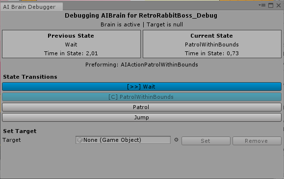
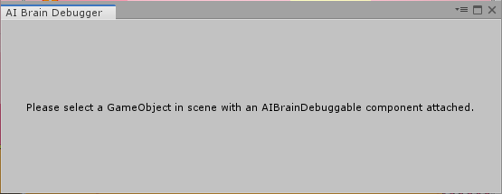
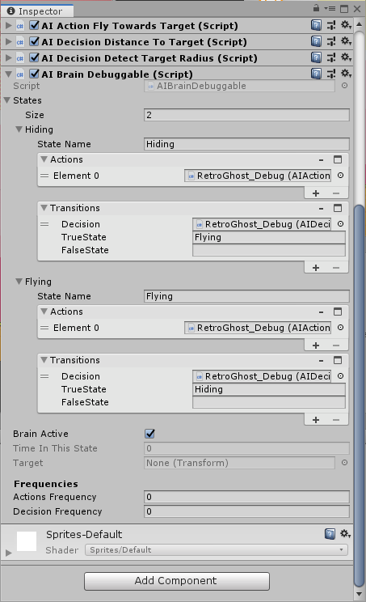

# The AIBrain Debugger

The **AIBrain Debugger** tool lets you peek into some inner workings of an AIBrain and modify runtime behaviours.

To check the debugger in function, please watch the video below:



### Opening the AIBrain Debugger Window

To open the debugger window, simply select from the Main menu _Tools &gt; The Bit Cave &gt; AI Brain Debugger_.

### Using the AIBrainDebuggable Component

To debug a brain, you will need an _AIBrainDebuggable_ component, that is an extension of the regular MMTools _AIBrain_.To add such brain select _Add Component &gt; CorgiExtensions &gt; AI &gt; AI Brain Debuggable_.

This brain works exactly like a regular brain, so you can add states and transitions, but it will give some more additional info to the debugger.

### Debugging an AIBrain

To start debugging a debuggable AI Brain, all you have to do is to play the scene from the Unity Editor and select a gameobject with an _AIBrainDebuggable_. The brain is divided in three main sections:

* _Brain state_
* _Transitions_
* _Target_

#### Brain State

The _Brain State_ section shows the brain status during gameplay. Info displayed are:

* The selected gameobject
* Brain status \(active or not\)
* Current brain target \(if any\)
* The previous state and how much time the brain has been in it
* The current state and how much time has passed since the brain entered it
* Which actions the brain is performing

#### Transitions

This section will display all available states in the brain. Each state is displayed as a button, so you can force the transition if it is needed. A state can be:

* **\[C\]** The current state: in this case the button will be disabled
* **\[&gt;&gt;\]** A state connected with the current state
* A state disconnected with the current state

_Note that you can force the transition even to a disconnected state: this is pretty useful if you are working with the_ [_Master/Slave brain features_](../master-slave-brains/untitled.md)_._

#### Target

This section will allow you to set the brain target or remove it if needed.

_Note that you can force any kind of target, not just the one selected by the brain._

