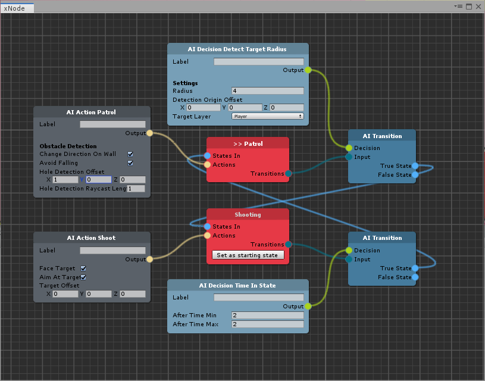

# Corgi Engine - Getting Started Tutorial

**Note**: To get you started using the AI Brain Graph, you should first follow the [Install instructions](../install-instructions.md) and check that everything is working.

### The Tutorial Scene

First of all, look for the _AIBrain\_Tutorial_ scene \(and open it\), that will serve as a starting point for this tutorial. Basically, it is the Corgi _RetroAI_ scene with all enemies removed \(with the exception of _RetroSwordsman_\).

1. Open the _Enemies_ group to check the content: you will find the _RetroSwordsman_ prefab and two other gameObjects \(stripped out of all AI components\): _RetroSwordsmanGenerated_ and _RetroSwordsmanPluggable._

### Creating the AI Brain Graph

To start working with the graph, you'll need to create an AI Brain Graph:

1. In the Project panel, right-click the mouse button and select _Create &gt; The Bit Cave &gt; AI Brain Graph_
2. Rename the newly created asset _RetroSwordman AIBrain_ \(or anything you deem appropriate\)
3. Double-click on the asset to open the Editor

### The RetroSwordsman AI Brain Structure

Select the _RetroSwordsman_ prefab in scene and look at the _AI Brain_, _AI Actions_ and _AI Decisions_ components: we want to replicate the same structure with the AI Brain Graph:

* The _AI Brain_ has two states: _Patrol_ and _Shooting_
* While in _Patrol_ the swordsman will perform an _AIActionPatrol_ action
* While in _Shooting_ the swordsman will perform an _AIActionShoot_ action
* The swordsman will exit the _Patrol_ state if the target is within range \(_AIDecisionDetectTargetRadius_\)
* The swordsman will exit the _Shooting_ state after a while \(_AIDecisionTimeInState_\)

To create the AI Brain Graph we will need these nodes:

* Two states
* Two transistions
* Two actions
* Two decisions

#### Creating the States

First of all, let's create the two states:

1. Right click on the AI Brain graph canvas and choose _AI &gt; Brain State_: this will create a state
2. Right click on the node header and choose _Rename_. Rename the state _Patrol_ and select _Apply_
3. Repeat the first two steps, creating another node called _Shooting_
4. On the _Patrol_ node, click the _Set as starting state_ button: this will set the _Patrol_ node as the entry state in the character brain


Each state should always have a unique name


#### Adding Transitions

Each state has a single transition, so we are going to create two and connect them with _Patrol_ and _Shooting_:

1. Right click on the Graph canvas and select _AI &gt; Transition_: this will add a transition node
2. Click on the _transitions_ output in _Patrol_ state and drag it to the _Input_ element of the transition node
3. Repeat the first two steps for the _Shooting_ state

#### Adding AI Decisions

The original swordsman has two decisions, each one connected with a state, so let's add them to the graph.

For the _Patrol_ state:

1. Right click on the graph canvas and select _AI &gt; Decision &gt; Detect Target Radius_
2. Set the _Radius_ to 4
3. Set the _Target Layer_ to _Player_
4. Connect the _Output_ element to the _Decision_ input of the patrol state _AI Transition_ node

For the _Shooting_ state:

1. Right click on the graph canvas and select _AI &gt; Decision &gt; Time In State_
2. Let the fields to their default values
3. Connect the _Output_ element to the _Decision_ input of the shooting state _AI Transition_ node

#### Adding AI Actions

The swordsman has two actions, each one connected with a state: let's add them to the graph.

For the _Patrol_ state:

1. Right click on the graph canvas and select _AI &gt; Action &gt; Patrol_
2. Check the _Avoid Falling_ value
3. Set the _Hole Detection Offset_ x value to 1
4. Connect the _Output_ element to the _Actions_ input of the _Patrol_ state node

For the _Shooting_ state:

1. Right click on the graph canvas and select _AI &gt; Action &gt; Shoot_
2. Check the _Aim At Target_ value
3. Connect the _Output_ element to the _Actions_ input of the _Shooting_ state node

#### Connecting Transitions

The last step to complete the brain graph is to connect the transitions _True/False_ states. In this case we only need the _True_ ones:

1. Connect the _True State_ of the patrol _AI Transition_ to the _States in_ input of the _Shooting_ state
2. Connect the _True State_ of the shooting _AI Transition_ to the _States in_ input of the _Patrol_ state

### Generating the Character AIBrain System

We are now ready to add the brain graph to a gameObject and generate all the Corgi AI structure: we have two options for this.

#### AI Brain Generator

The _AI Brain Generator_ component adds a static brain structure to your character, just like you are used to do in Corgi:

1. Enable the _RetroSwordsmanGenerated_ gameObject
2. Click the _Add Component_ button and select _The Bit Cave &gt; AI &gt; AI Brain Generator_
3. Drag the _RetroSwordsman AIBrain_ we created above in the _AI Brain Graph_ field
4. Click the _Generate_ button and you will get the full working Corgi AI system for the _RetroSwordsman_ \(try comparing it with the original prefab\)


Once you are happy with your brain, you can safely remove the AI Brain Generator component as it is not used during gameplay


#### AI Brain Pluggable

The _AI Brain Pluggable_ generates all Corgi AI system at runtime from a list of brain graphs:

1. Enable the _RetroSwordsmanPluggable_ gameObject
2. Click the _Add Component_ button and select _The Bit Cave &gt; AI &gt; AI Brain Pluggable_
3. Drag the _RetroSwordsman AIBrain_ in the _AI Brain Graphs_ field: this is an array of elements, so you can add more than one \(one will be chosen randomly at runtime\)
4. Hit the Editor _Play_ button and you should see the Corgi AI Brain structure generated


The AI Brain Pluggable is an extension of the regular Corgi AI Brain, so you have to keep it in your gameObject


