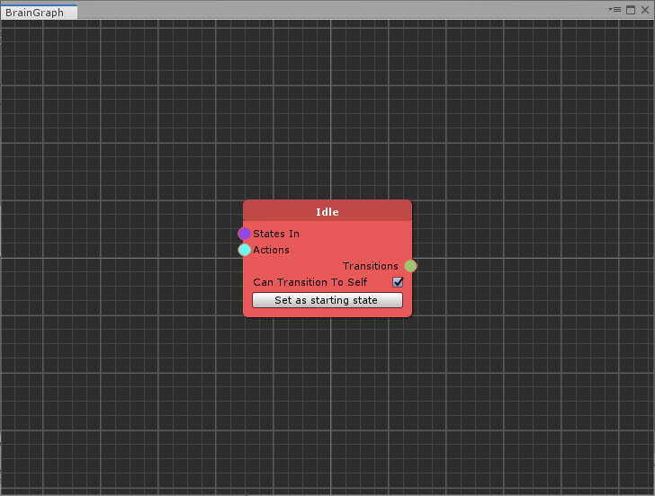
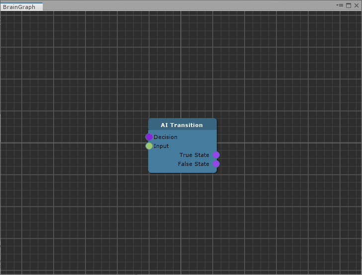
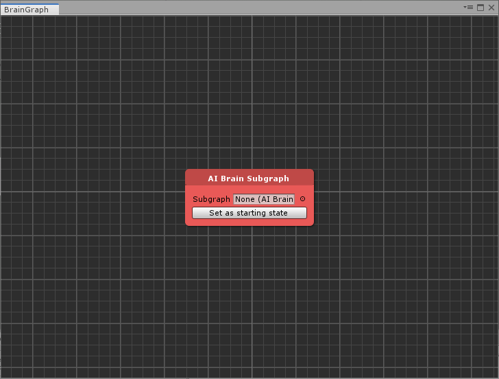
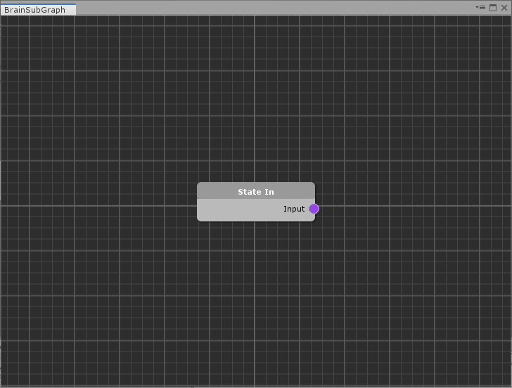

# Node Reference

The _AI Brain Graph_ comes packed with four main type  of nodes:

* _AI Brain State Node_
* _AI Transition Node_
* _AI Action Node_
* _AI Decision Node_

Additionally, when you work with a Subgraph, you have access to:

* _AI Brain Subgraph Nodes_
* _AI State In Nodes_
* _AI Transition Out Nodes_

### AI Brain State Nodes

A **State** node represents a single state in the MMTools _AIBrain_.


Each state should be given a unique name by right-clicking the header and choosing _Rename._


The _Set as starting state_ button will set the state as the first one in the MMTools _AIBrain_ states list.

#### Attributes

* **Can Transition To Self**: if set to false, self referencing transitions will be removed \(for instance _Idle &gt; Idle_\)

#### Inputs

* **States In** \(multiple _State_ connections\): a list of entry points from other states transitions
* **Actions** \(multiple _Action_ connections\): a list of actions that should be performed when entering the state itself

#### Outputs

* **Transitions** \(multiple _Transition_ connections\): a list of transitions that will let the system exit from this state 

### AI Transition Nodes

A **Transition** node represents a single transition from a state in the MMTools _AI Brain_: a state can have more than one transition.

If you wish, you can rename the node by right-clicking the header and choosing _Rename_ but this won't affect the AI generation.


A Transition node should always have a connected _AIDecision_ node


#### Attributes

This node has no attributes.

#### Inputs

* **Decision** \(single _Decision_ connection\): a single _AI Decision Node_ that will let the AI Brain exit from the actual state
* **Input** \(single _Transition_ connection\): a single connection from the _AI Brain State_

#### Outputs

* **True State** \(single _State_ connection\): a connection to the state that should be activated when the decision is true
* **False State** \(single _State_ connection\): a connection to the state that should be activated when the decision is false

### AI Action Nodes

**Action** nodes are graph representations of _AIAction_ components. They come with a single output element that should be connected to the state. This will tell the state itself that this action should be executed.

A node may have some parameters, corresponding with the Corgi/TopDown engine _AIAction_ components.

If you wish, you can rename the node by right-clicking the header and choosing _Rename_ but this won't affect the AI generation.

#### Attributes

* **Label**: corresponds to the regular _AIAction_ label
* Depending on the corresponding _AIAction_, you'll have access to a list of paramenters

#### Inputs

This node has no input connections.

#### Outputs

* **Output** \(multiple _Action_ connections\): a single _AI Decision Node_ that will let the AI Brain exit from the actual state

### AI Decision Nodes

**Decision** nodes are a graph representation of _AIDecision_ components. They come with a single output element that should be connected to a state transition. This will define the condition to exit the state.

If you wish, you can rename the node by right-clicking the header and choosing _Rename_ but this won't affect the AI generation.

#### Attributes

* **Label**: corresponds to the regular _AIDecision_ label
* Depending on the corresponding _AIDecision_, you'll have access to a list of paramenters

#### Inputs

This node has no input connections.

#### Outputs

* **Output** \(multiple _Decision_ connections\): a single _AIDecision Node_ that will let the AI Brain exit from the actual state

### AI Brain Subgraph Nodes

A **Subgraph** node is a special state node, that lets you create a inner state/decision/action logic. 

It can be set as a starting node \(in this case its inner starting node will be used\).

You can create a subgraph asset and assign it to the _Subgraph_ field.


You cannot create nested subgraphs \(i.e.: you cannot add a subgraph inside a subgraph\)


#### Attributes

* **Subgraph**: the subgraph data

#### Inputs

* **State In** __\(list of multiple _State_ connections\): a dynamically generated list of state connections \(see _AI State In Nodes_\)

**Outputs**

* **Transition Out** \(list of single _Transition_ connections\): a dynamically generated list of transition connections \(see _AI Transition Out Nodes_\)

### AI State In Nodes

The **AI State In** node exposes an _AI Brain State_ node inside a subgraph to the parent brain graph.


_State In_ nodes are only available in a subgraph.


#### Attributes

This node has no attributes

#### Inputs

This node has no input connections.

#### Outputs

* **Input** \(single _State_ connection\): this node will generate a _State In_ connection in the subgraph node of the parent graph

### AI Transition Out Nodes

The **AI Transition Out** node exposes an _AI Transition_ node connection inside a subgraph to the parent brain graph.


_Transition Out_ nodes are only available in a subgraph.


#### Attributes

This node has no attributes

#### Inputs

* **Output** \(single _Transition_ connection\): this node will generate a _Transition Out_ connection in the subgraph node of the parent graph

#### Outputs

This node has no output connections.

