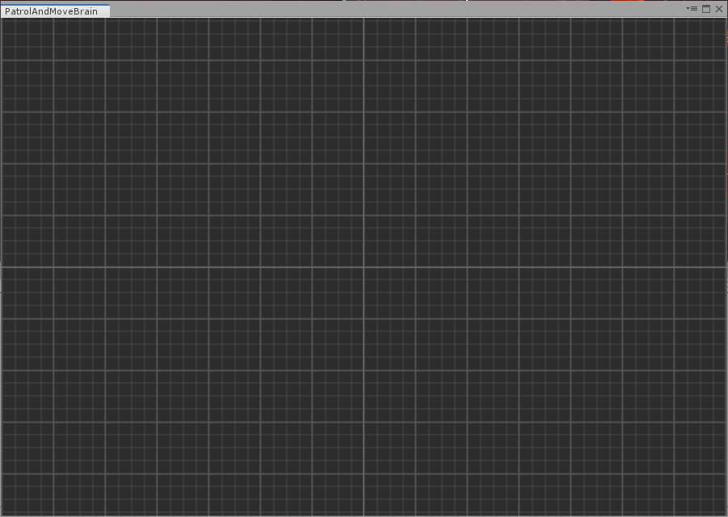
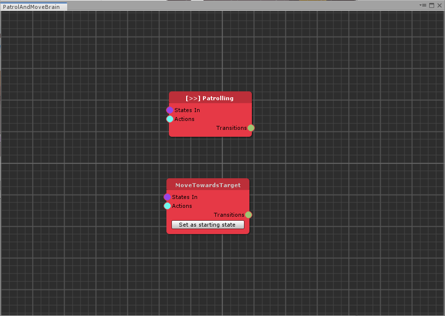
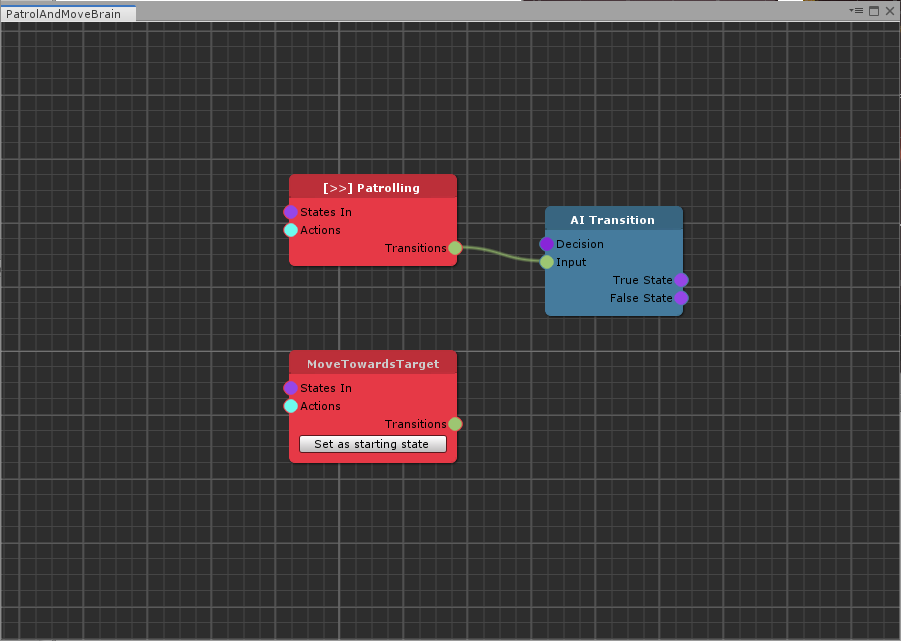
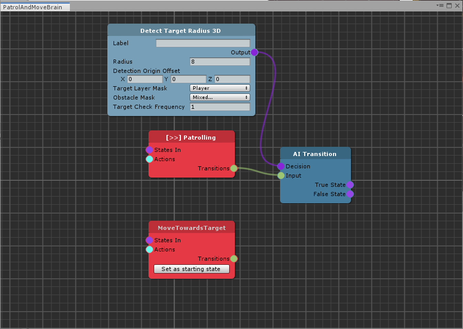
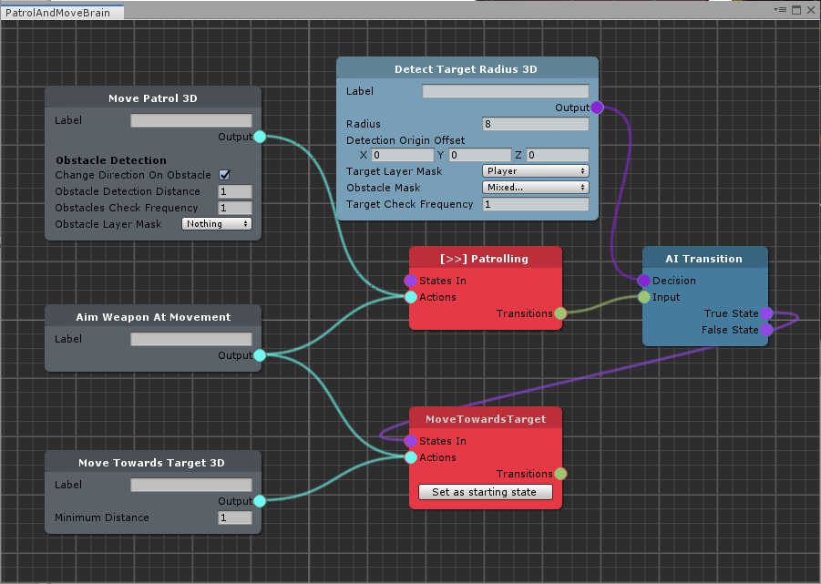
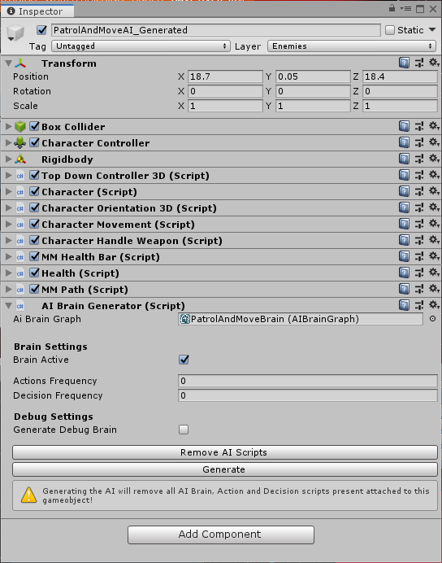
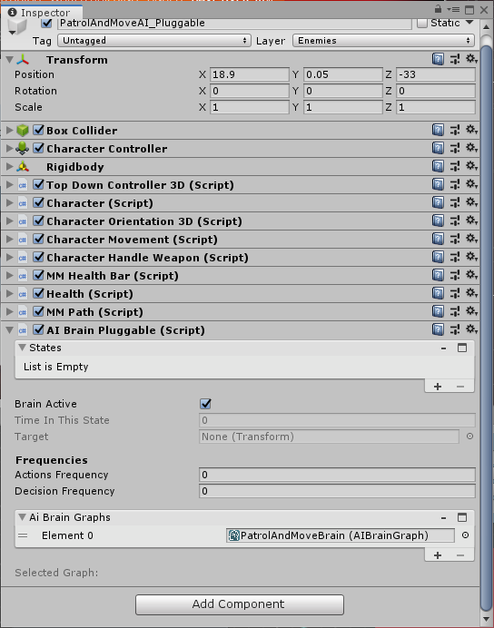

# TopDown Engine - Getting Started Tutorial

**Note**: To get you started using the AI Brain Graph, you should first follow the [Install instructions](../install-instructions.md) and check that everything is working.

### The Tutorial Scene

First of all, look for the _MinimalAI3D\_Tutorial_ scene \(and open it\), that will serve as a starting point for this tutorial. Basically, it is the TopDown _MinimalAI3D_ scene with all enemies removed \(with the exception of _PatrolAndMoveAI_\).

1. Open the _AIs_ group to check the content: you will find the _PatrolAndMoveAI_ prefab along with two other gameObjects \(stripped out of all AI components\): _PatrolAndMoveAI\_Generated_ and _PatrolAndMoveAI\_Pluggable._

### Creating the AI Brain Graph

To start working with the graph, you'll need to create an AI Brain Graph:

1. In the Project panel, right-click the mouse button and select _Create &gt; The Bit Cave &gt; AI Brain Graph_
2. Rename the newly created asset _PatrolAndMoveBrain_ \(or anything you deem appropriate\)
3. Double-click on the asset to open the Editor

### The PatrolAndMoveAI Brain Structure

Select the _PatrolAndMoveAI_ prefab in scene and look at the _AI Brain_, _AI Actions_ and _AI Decisions_ components: we want to replicate the same structure with the AI Brain Graph:

* The _AI Brain_ has two states: _Patrolling_ and _MoveTowardsTarget_
* While in _Patrolling_ the character will perform an _AIActionMovePatrol3D_ and an _AIActionAimWeaponAtMovement_ action
* While in _MoveTowardsTarget_ the character will perform an _AIActionMoveTowardsTarget3D_ and an _AIActionAIMWeaponATMovement_ action
* The chracters will exit the _Patrolling_ state if the target is within range \(_AIDecisionDetectTargetRadius3D_\)
* The character will not exit the M_oveTowardsTarget_ state after a while

To create the AI Brain Graph we will need these nodes:

* Two states
* Two transistions
* Three actions
* One decision

#### Creating the States

First of all, let's create the two states:

1. Right click on the AI Brain graph canvas and choose _AI &gt; Brain State_: this will create a state
2. Right click on the node header and choose _Rename_. Rename the state _Patrolling_ and select _Apply_
3. Repeat the first two steps, creating another node called _MoveTowardsTarget_
4. On the _Patrolling_ node, click the _Set as starting state_ button: this will set the _Patrolling_ node as the entry state in the character brain


Each state should always have a unique name


#### Adding Transitions

The _Patrolling_ state has a single transition, so we are going to create it:

1. Right click on the Graph canvas and select _AI &gt; Transition_: this will add a transition node
2. Click on the _transitions_ output in _Patrolling_ state and drag it to the _Input_ element of the transition node


There's no decision for the _MoveTowardsTarget_ state, so we won't need a transition.


#### Adding AI Decisions

The original character has a single decision, connected with the _Patrolling_ state, so let's add it to the graph.

1. Right click on the graph canvas and select _AI &gt; Decision &gt; 3D &gt; Detect Target Radius_
2. Set the _Radius_ to 8
3. Set the _Target Layer Mask_ to _Player_
4. Set the Obstacle _Mask_ to _Obstacles_, _ObstaclesDoors_, _NoPathfinding_
5. Connect the _Output_ element to the _Decision_ input of the patrolling state _AI Transition_ node

#### Adding AI Actions

The swordsman has three actions, with one of them in common with both states: let's add them to the graph.

For the _Patrolling_ state:

1. Right click on the graph canvas and select _AI &gt; Action &gt; 3D &gt; Move Patrol_
   1. Set the Obstacle _Mask_ to _Obstacles_, _ObstaclesDoors_, _NoPathfinding_
   2. Connect the _Output_ element to the _Actions_ input of the _Patroling_ state node
2. Right click on the graph canvas and select _AI &gt; Action &gt; Aim Weapon At Movement_
   1. Connect the _Output_ element to the _Actions_ input of the _Patrolling_ state node

For the _MoveTowardsTarget_ state:

1. Right click on the graph canvas and select _AI &gt; Action &gt; 3D &gt; Move Towards Target_
   1. Connect the _Output_ element to the _Actions_ input of the _MoveTowardsTarget_ state node
2. You don't need to create a second _Aim Weapon At Movement_
   1. Connect the _Output_ element to the _Actions_ input of the _MoveTowardsTarget_ state node

#### Connecting Transitions

The last step to complete the brain graph is to connect the transitions _True/False_ states. In this case we only need the _True_ one:

1. Connect the _True State_ of the patrolling _AI Transition_ to the _States in_ input of the _MoveTowardsTarget_ state

### Generating the Character AIBrain System

We are now ready to add the brain graph to a gameObject and generate all the TopDown Engine AI structure: we have two options for this.

#### AI Brain Generator

The _AI Brain Generator_ component adds a static brain structure to your character, just like you are used to do in TopDown Engine:

1. Enable the _PatrolAndMoveAI\_Generated_ gameObject
2. Click the _Add Component_ button and select _The Bit Cave &gt; AI &gt; AI Brain Generator_
3. Drag the _PatrolAndMoveBrain_ we created above in the _AI Brain Graph_ field
4. Click the _Generate_ button and you will get the full working TopDown AI system for the _PatrolAndMoveAI_ \(try comparing it with the original prefab\)


Once you are happy with your brain, you can safely remove the AI Brain Generator component as it is not used during gameplay


#### AI Brain Pluggable

The _AI Brain Pluggable_ generates all Corgi AI system at runtime from a list of brain graphs:

1. Enable the _PatrolAndMoveAI\_Pluggable_ gameObject
2. Click the _Add Component_ button and select _The Bit Cave &gt; AI &gt; AI Brain Pluggable_
3. Drag the _PatrolAndMoveBrain_ in the _AI Brain Graphs_ field: this is an array of elements, so you can add more than one \(one will be chosen randomly at runtime\)
4. Editor _Play_ button and you should see the TopDown Engine AI Brain structure generated


The AI Brain Pluggable is an extension of the regular TopDown Engine AI Brain, so you have to keep it in your gameObject


