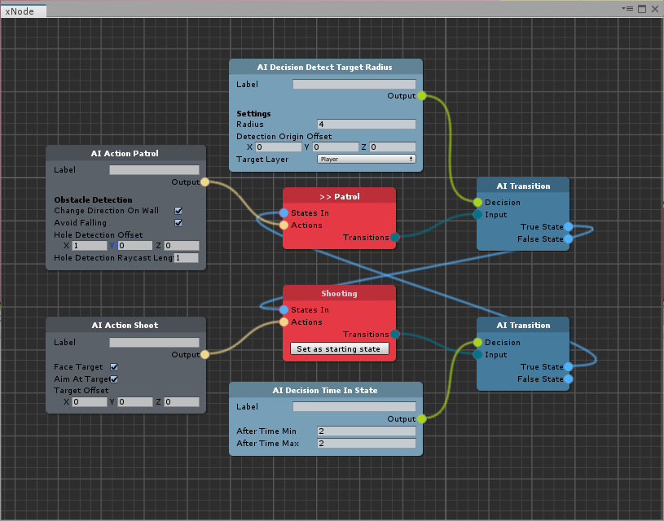

# Features

In this page you will find listed all the features of the package: all of them are tools for MoreMountains AIBrain system.

### 1. AIBrain Graph

The **AI Brain Graph** system lets you create AIBrains systems by using a node system.

The AIBrain Graph is based on [xNode](https://github.com/Siccity/xNode), an opensource project by [Thor Brigsted](https://github.com/Siccity).

The graph includes the following features;

* A _visual editing canvas_ with nodes for all the official AIDecisions and AIActions of Corgi and TopDown Engines
* A _subgraph system_ for better reorganization and reusability
* An _AI Brain Generator_ component, for quick creation of brain system starting from a brain graph
* An _AI Pluggable Brain_ component for runtime generation of AI systems

### 2. AIBrain Debugger

The **AIBrain Debugger** system will let you peek into some of the AIBrain inner workings and test states at runtime.

The debugger includes the following features:

* An  _AIBrainDebuggable_ component, that is an extension of the regular AIBrain component
* An _AIBrain Debugger_ window to check what's going on at runtime including:
  * Force transitions during gameplay
  * Force the brain Target during gameplay
  * Track current/previous brain state tracking

### 3. Master/Slave Brains

The **Master/Brain** system will let you control an AIBrain \(or a group of AIBrains\) from another point in your game, usually from another AIBrain.

The Master/Brain system includes the following features:

* A _channel_ system to send brain commands through the _MMEventManager_
* A Master component to send state change commands through a channel
* A Slave component to receive state change commands from one or more channels

